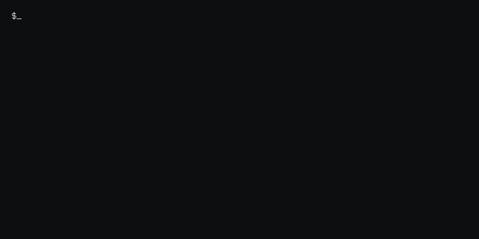

<h1 align="center">Mohammad Issa</h1>

  Cloud Engineer &nbsp;·&nbsp; AWS & Azure &nbsp;·&nbsp; Linux &nbsp;·&nbsp; DevOps

  

---

## 👤 About

- ☁️ Cloud Engineer focused on designing, deploying, and maintaining scalable cloud solutions
- 🐧 Experienced with Linux systems, networking fundamentals, and automation scripting
- 🚀 Interested in Cloud Infrastructure, DevOps practices, CI/CD pipelines, and Infrastructure as Code
- 🔧 Building real-world projects using AWS, Docker, and automation tools

---

## 🛠️ Cloud & DevOps Stack

&nbsp;

&nbsp;

&nbsp;

&nbsp;

&nbsp;

&nbsp;

&nbsp;

&nbsp;

---

## 🔗 Connect

<table align="center">
<tr>

<td align="center">

</td>

</tr>

<tr>
<td align="center">

</td>

</tr>

</table>

<tr>
<td colspan="2"> </td>
</tr>

<tr>

<td width="50%" valign="top">

---

# 🚀 Projects

<table width="100%" cellspacing="0" cellpadding="15">

<tr>

<td width="50%" valign="top" style="border:1px solid #30363d;">

<h3>🏥 QCare — Cloud Hosted Smart Clinic System</h3>

<em>ASP.NET Core · React · PostgreSQL · aws · Docker</em>

A full-stack healthcare management platform deployed on Azure with cloud-based architecture and secure access management.

<ul>
<li>ASP.NET Core REST API backend</li>
<li>React frontend application</li>
<li>JWT authentication with role-based access</li>
<li>Docker containerization</li>
<li>aws cloud deployment</li>
<li>PostgreSQL database hosting</li>
<li>CI/CD pipeline using GitHub Actions</li>
</ul>

</td>

<td width="50%" valign="top" style="border:1px solid #30363d;">
<h3>🇱🇧 Lebanon Tourism Mobile Application</h3>

<em>Android Studio · Java · Firebase Firestore</em>

A mobile application designed to showcase tourism destinations in Lebanon, providing users with information about landmarks, locations, and attractions.

<ul>
<li>Developed an Android mobile application using Android Studio</li>
<li>Designed user interfaces for browsing tourism destinations</li>
<li>Integrated Firebase Firestore for storing and retrieving application data</li>
<li>Implemented database connectivity and real-time data management</li>
<li>Structured application components following Android development practices</li>
</ul>

</td>

</tr>

<tr>

<td width="50%" valign="top" style="border:1px solid #30363d;">

<h3>🏟️ Ehjoz - Sports Stadium Reservation & Management System</h3>

<em>.NET · C# · SQL Server · Full-Stack Development</em>

A full-stack web application designed to manage sports stadium reservations, allowing users to browse available facilities, book time slots, and manage stadium operations.

<ul>
<li>Developed a full-stack application using .NET and C#</li>
<li>Designed and implemented database structures for users, stadiums, and reservations</li>
<li>Built reservation management workflows and application logic</li>
<li>Created user interfaces for booking and stadium administration</li>
<li>Integrated backend services with database operations</li>
</ul>

</td>

<td width="50%" valign="top" style="border:1px solid #30363d;">

<h3>🌌 Galaxy Website</h3>

<em>Python · Flask · HTML/CSS · JavaScript</em>

A full-stack informational web application about galaxies, built using Flask with a structured backend and user-facing web interface.

<ul>
<li>Developed a Flask-based web application</li>
<li>Designed and organized website content and application structure</li>
<li>Implemented backend routes and application logic</li>
<li>Created an interactive and responsive user interface</li>
</ul>

</td>

</tr>

<tr>

<td width="50%" valign="top" style="border:1px solid #30363d;">

  
<em>More projects coming soon...</em>
  

</td>

</tr>

</table>

---

<!-- Contribution Snake -->

---

